# Image-Processing
HFUT 2022spring Digital Image Processing and Application
# 第三章 空域增强技术
## 3.1 空域技术分类
- 什么是图像的空域？
  - 就是**像素**组成的空间
- 点操作：对每个像素进行操作
- 模板操作（template）：使用template对图像进行卷积
## 3.2 直接灰度映射
- 点操作
- 本质就是将一个灰度值（根据公式）映射为另一个灰度值。公式根据实际需要随你编
## 3.3 直方图变换
- 什么是直方图
  - 数字图像中每一灰度级与它出现的频数之间的统计
  
  - 提供了图像像素的灰度值分布情况
  
  - 一个$ 维度 = 灰度级$的向量
  
    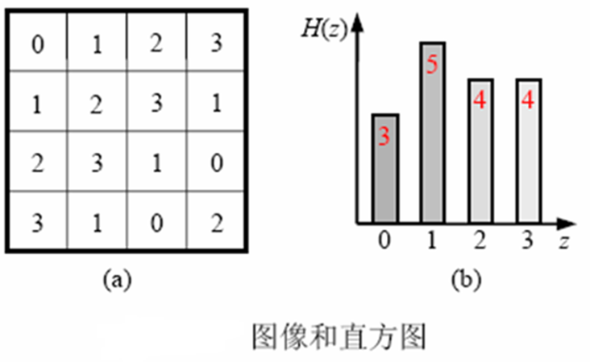
  
- 直方图均衡化

  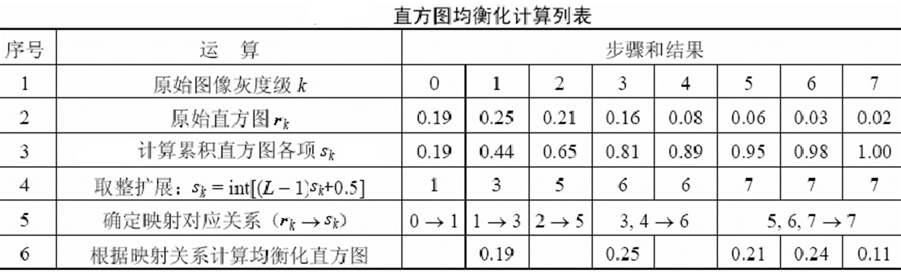

- 直方图规定化

  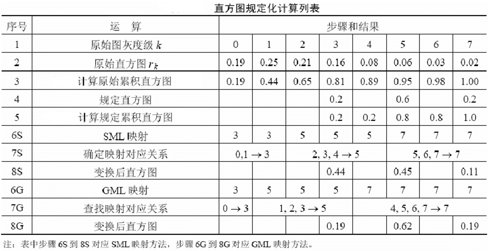

  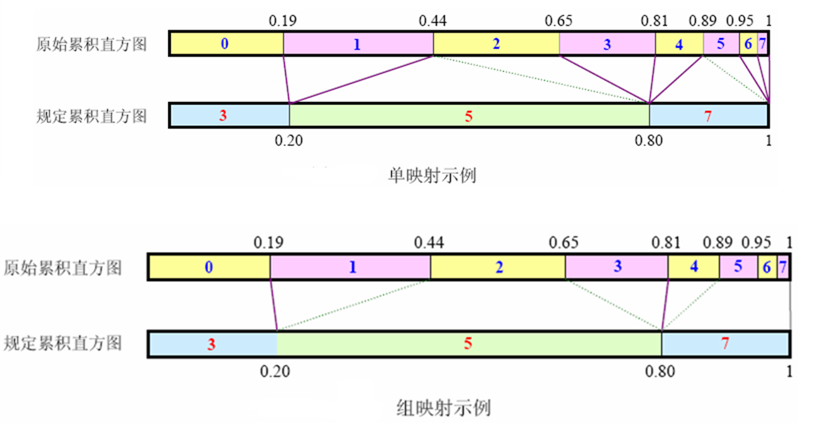

  
## 3.4 线性滤波

### 3.4.1 线性平滑滤波器

- 领域平均滤波器

  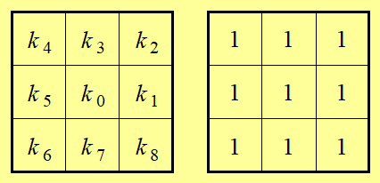

- 加权平均滤波器

  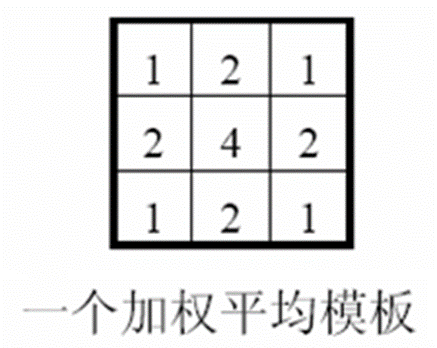

- template越大，噪声消除效果越好，但是图片越模糊

## 3.5 非线性滤波

### 3.5.1 非线性平滑滤波器

- 作用既消除噪声又保持细节

- 中值滤波器

  - 1D中值滤波器（width=3）

    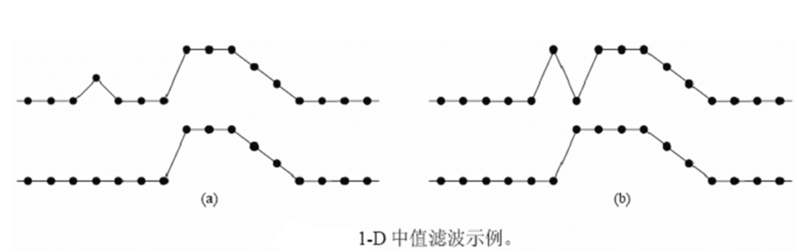
  
- 百分比(percentile)滤波器

### 3.5.2非线性锐化滤波器

- 利用微分可以锐化图像

  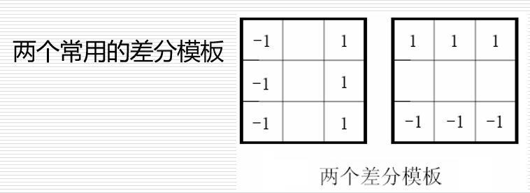

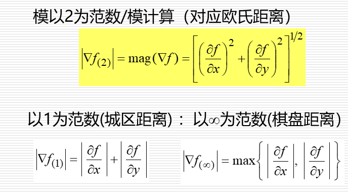

- 最大-最小锐化变换

​    是一种图像增强技术。将最大值滤波器和最小值滤波器结合使用，可以锐化模糊的边缘并让模糊的目标清晰起来

## 3.6 局部增强

# 第四章 图像分割

## 4.1 基于阈值的分割方法

### 4.1.1 P参数法

### 4.1.2 状态法（峰谷法）

### 4.1.3 全局门限处理法

### 4.1.4 最大类间方差法

## 4.2 基于边缘的分割方法

### 4.2.1 边缘的定义

图像中像素灰度有**阶跃变化**或**屋顶变化**的那些像素的集合

### 4.2.2 边缘的分类

- 阶跃状

  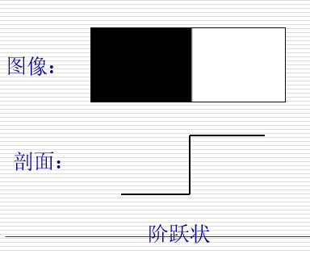

- 屋顶状

  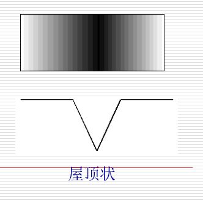

### 4.2.3 边缘检测算子
- 梯度算子

- Roberts算子

- Prewitt算子

- Sobel算子

  - 公式

    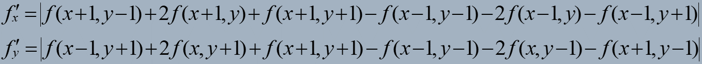

  - 模板

    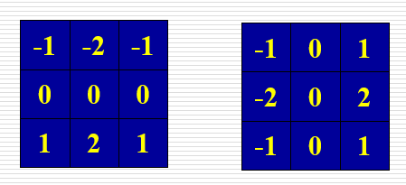

  - 特点

    对4邻域采用带权方法计算差分；能进一步抑止噪声；但检测的边缘较宽。

- Kersch算子

- Nevitia算子

- 拉普拉斯算子

  - 离散形式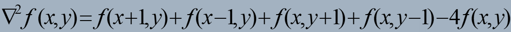

  - 模板：可以用多种方式被表示为数字形式。定义数字形式的拉普拉斯的基本要求是，作用于中心像素的系数是一个负数，而且其周围像素的系数为正数，系数之和必为0。对于一个3x3的区域，经验上被推荐最多的形式是：

    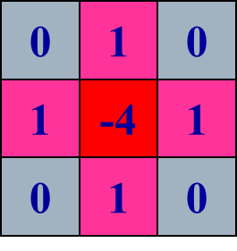

    >    由于梯度算子和Laplace算子都对噪声敏感，因此一般在用它们检测边缘前要先对图像进行平滑。 